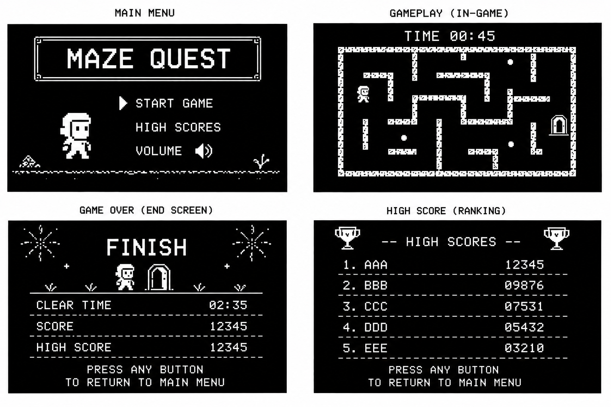

## 遊戲基本說明

遊戲名稱：MAZE QUEST

選擇的題目：迷宮逃脫

玩家要做什麼：進入遊戲後走出迷宮得分

怎麼得分：每個關卡100分，倒計時剩下20秒時開始扣分，每秒扣5分，計算通關時剩餘分數決定得分

關卡設計：有三個關卡，每個關卡30秒倒計時，走出迷宮及通過

遊戲結束條件：倒計時間數、遊戲通關

搖桿X軸的用途：上下移動

搖桿Y軸的用途：左右移動、調整音量

搖桿按壓(SW)的用途：確認

按鈕A的用途：確認

按鈕B的用途：返回、暫停

搖桿使用方式：方向判斷 direction()

原因：遊戲需要控制左右移動

## FSM 狀態清單

| State | 一次性進入時做什麼 | 持續性做什麼 | 可觸發的轉移條件 |
|---|---|---|---|
| menu | 顯示主選單、重置關卡進度、重置計時器 | 等待玩家按下開始鍵 | 按開始 → level_1； 按排名 → rank|
| level_1 | 載入第一關地圖、設定玩家起點、啟動倒計時 | 更新玩家移動、碰撞偵測、倒計時、判斷是否到達終點 | 過關 → level_2；時間到 → finish；按下按鈕B → pause |
| level_2 | 載入第二關地圖、設定玩家起點、重設本關計時器 | 更新玩家移動、碰撞偵測、倒計時、判斷是否到達終點 | 過關 → level_3；時間到 → finish；按下按鈕B → pause |
| level_3 | 載入第三關地圖、設定玩家起點、重設本關計時器 | 更新玩家移動、碰撞偵測、倒計時、判斷是否到達終點 | 過關 → finish；時間到 → finish；按下按鈕B → pause |
| pause | 顯示暫停畫面、暫停倒計時 | 等待玩家選擇繼續或回主選單 | 按下按鈕B → 回到暫停前的關卡；按回主選單 → menu |
| finish | 顯示、計算分數、停止遊戲計時 | 等待玩家回主選單 | 按下按鈕 → menu |
|rank|顯示出分數排名|等待玩家回主選單|按下按鈕 → menu|
|setting|顯示音量|等待玩家調整音量|按下按鈕B → menu|

## OLED 畫面草圖

## 模組架構

|檔案名稱|職責說明|對外提供的主要函式或類別|
|-|-|-|
|main.py|程式進入點，初始化硬體物件，建立各模組，啟動 uasyncio 任務，保持 main.py 在 150 行內|main()、game_loop()|
|game.py|遊戲核心邏輯，管理 FSM 狀態、關卡切換、玩家位置、碰撞偵測、倒計時、分數計算|GameEngine、update()、handle_input()、get_snapshot()|
|map_data.py|儲存三個迷宮關卡資料、起點、終點，讓 game.py 載入地圖時不需要把地圖寫在主程式中|LEVEL_MAPS、START_POINTS、END_POINTS|
|display_unit.py|管理 OLED 畫面，依照目前狀態繪製選單、迷宮、暫停、結算、排名、設定畫面|DisplayUnit、draw_menu()、draw_game()、draw_finish()、draw_rank()、draw_setting()|
|input_unit.py|整合按鈕 A、按鈕 B、搖桿按壓，做去彈跳並轉成遊戲事件|InputUnit、read_events()、is_confirm()、is_back()|
|joystick.py|讀取搖桿 X/Y 軸 ADC，判斷方向，並在 setting 狀態提供音量調整數值|Joystick、direction()、volume_level()|
|score_manager.py|管理 Flash 中的分數檔案，紀錄最高 5 名與最後一次遊戲分數|ScoreManager、load_scores()、save_score()、get_top_scores()、get_last_score()|
|sounds.py|用 PWM 控制蜂鳴器，播放背景音樂與事件音效，並支援音量設定|SoundManager、play_bgm()、play_effect()、set_volume()、stop()|
|config.py|集中放硬體腳位、畫面大小、倒計時秒數、分數規則等常數|PIN_OLED_SDA、PIN_BUZZER、LEVEL_TIME、BASE_SCORE|

說明模組之間的資料傳遞方式，以及並行任務的分工：

main.py 會建立 GameEngine、DisplayUnit、InputUnit、Joystick、ScoreManager、SoundManager。InputUnit 與 Joystick 負責把硬體輸入轉成方向或按鍵事件，GameEngine 只接收整理後的事件，不直接操作硬體。GameEngine 每次 update() 後提供一份 snapshot，例如目前 state、關卡、玩家位置、剩餘秒數、分數、排名資料、音量值。DisplayUnit 只根據 snapshot 畫畫面，不改遊戲狀態。SoundManager 依照 GameEngine 回傳的音效事件或目前倒數階段切換音樂。ScoreManager 只在進入 finish 狀態時計算並寫入 Flash，避免每一幀都寫檔造成 Flash 壽命浪費。

並行任務選擇：uasyncio

原因：遊戲需要同時處理輸入、畫面更新、倒計時與蜂鳴器音效。使用 uasyncio 可以用非阻塞方式播放音效，避免蜂鳴器播放旋律時卡住玩家移動或 OLED 更新。相較於 _thread，uasyncio 的共享狀態較單純，適合這個專題規模。

主任務負責：game_loop() 每 50 ms 讀取目前輸入事件，呼叫 GameEngine 更新 FSM、移動與碰撞，必要時呼叫 ScoreManager 儲存分數，再呼叫 DisplayUnit 更新 OLED。

背景任務負責：
- input_task() 每 20 ms 掃描按鈕與搖桿，處理去彈跳與方向判斷。
- sound_task() 依照目前倒計時階段播放一般、緊湊、急迫 BGM，並在 finish 狀態播放通關或失敗音樂。
- timer 使用 time.ticks_ms() 在 GameEngine 內計算，不另外開阻塞式 sleep 倒數，pause 狀態會停止扣時間。

## 音效規劃

|事件|音符或頻率|持續時間(ms)|
|-|-|-|
|進入關卡、倒計時 30~21 秒，一般 BGM|C5(523)、E5(659)、G5(784)、E5(659)，循環播放|每音 160 ms，音與音間隔 40 ms|
|倒計時剩 20~11 秒，緊湊 BGM|E5(659)、G5(784)、B5(988)、G5(784)，循環播放|每音 110 ms，音與音間隔 30 ms|
|倒計時剩 10~1 秒，最急迫 BGM|C6(1047)、休止、C6(1047)、休止，快速重複|每音 70 ms，休止 70 ms|
|單關過關，切換到下一關|G5(784)、C6(1047)、E6(1319)|每音 120 ms|
|三關全部通關，在結算畫面播放成功 BGM|C5(523)、E5(659)、G5(784)、C6(1047)、G5(784)、C6(1047)|每音 180 ms|
|時間到或失敗，在結算畫面播放失敗 BGM|E5(659)、C5(523)、A4(440)、F4(349)|每音 220 ms|
|按下確認鍵或選單移動|C5(523)|60 ms|
